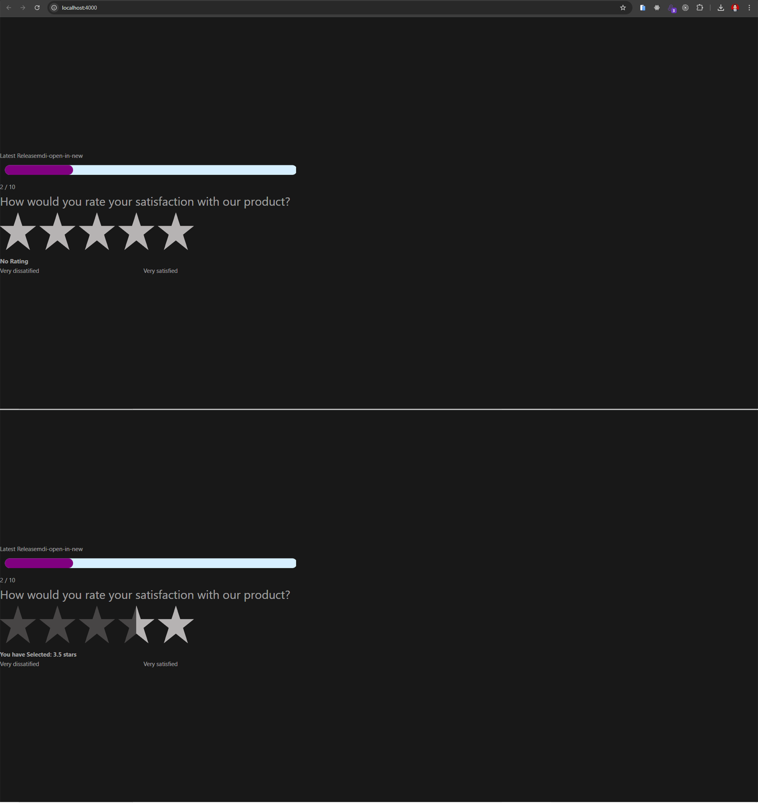

<h1 align="center">
  <a href="https://github.com/Alamnzr123/vue-app-v2">
  Feedback Form Application
  </a>
  <br />
</h1>



**Feedback Form Application** is application when user click star from 1-5 and a data will store on PostgreSQL fully coded in **Vue2**.
Simple & light is designed to provide all the basic components using the `sx` prop for a developer need to create feedback form.

## Live Demo

Take a look the live demo here 👉 [https://vue-app-v2.vercel.app/](https://vue-app-v2.vercel.app/)

## Backend App

Take a look the backend project here 👉 [https://github.com/Alamnzr123/alembic-fastapi](https://github.com/Alamnzr123/alembic-fastapi)

## Recommended IDE Setup

[VSCode](https://code.visualstudio.com/) + [Volar](https://marketplace.visualstudio.com/items?itemName=Vue.volar) (and disable Vetur) + [TypeScript Vue Plugin (Volar)](https://marketplace.visualstudio.com/items?itemName=Vue.vscode-typescript-vue-plugin).

## Customize configuration

See [Vite Configuration Reference](https://vitejs.dev/config/).

## Project Setup

```sh
npm install
```

### Compile and Hot-Reload for Development

```sh
npm run dev
```

### Compile and Minify for Production

```sh
npm run build
```

### Run Unit Tests with [Vitest](https://vitest.dev/)

```sh
npm run test:unit
```

### Run End-to-End Tests with [Cypress](https://www.cypress.io/)

```sh
npm run build
npm run test:e2e # or `npm run test:e2e:ci` for headless testing
```

### Lint with [ESLint](https://eslint.org/)

```sh
npm run lint
```
